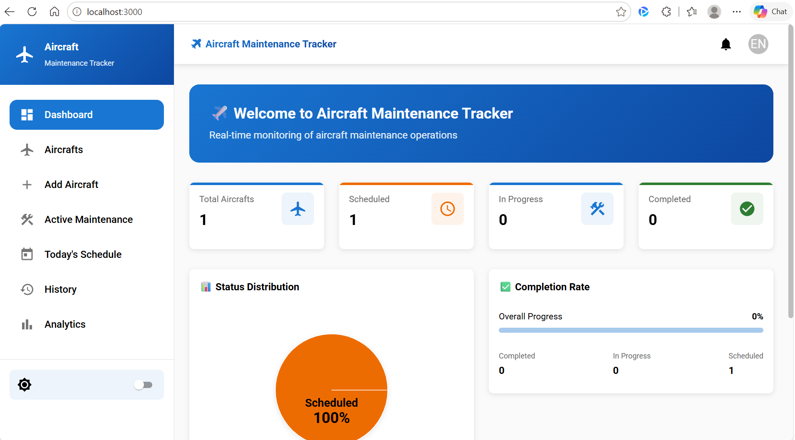
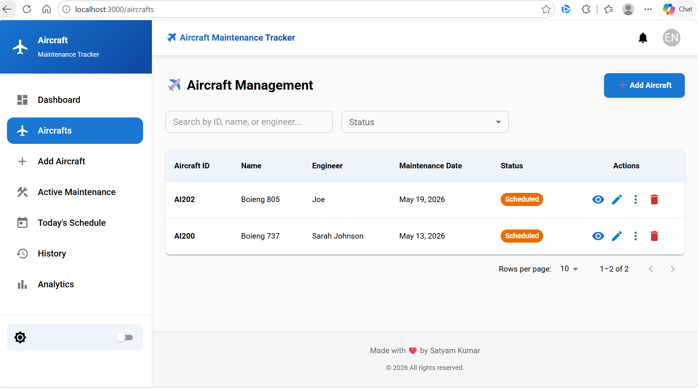
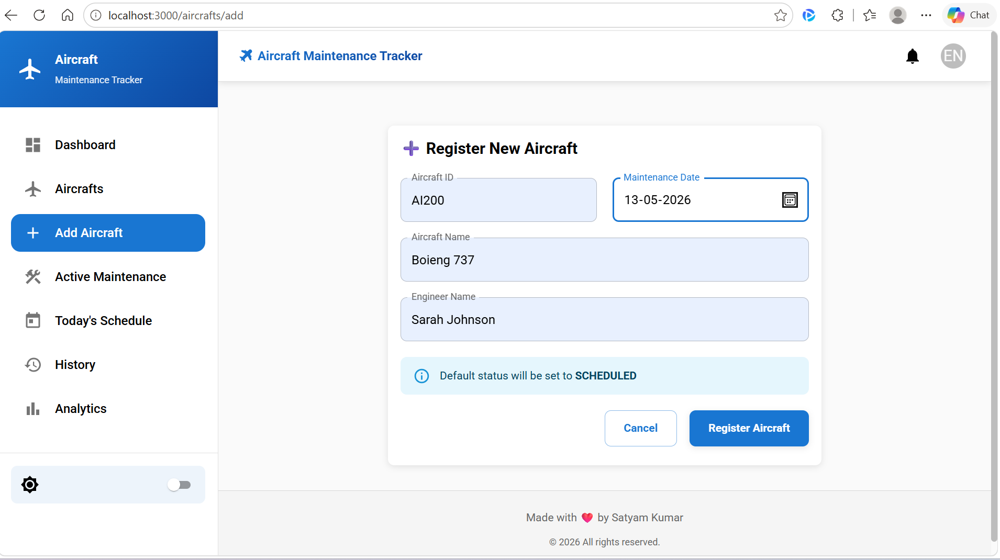
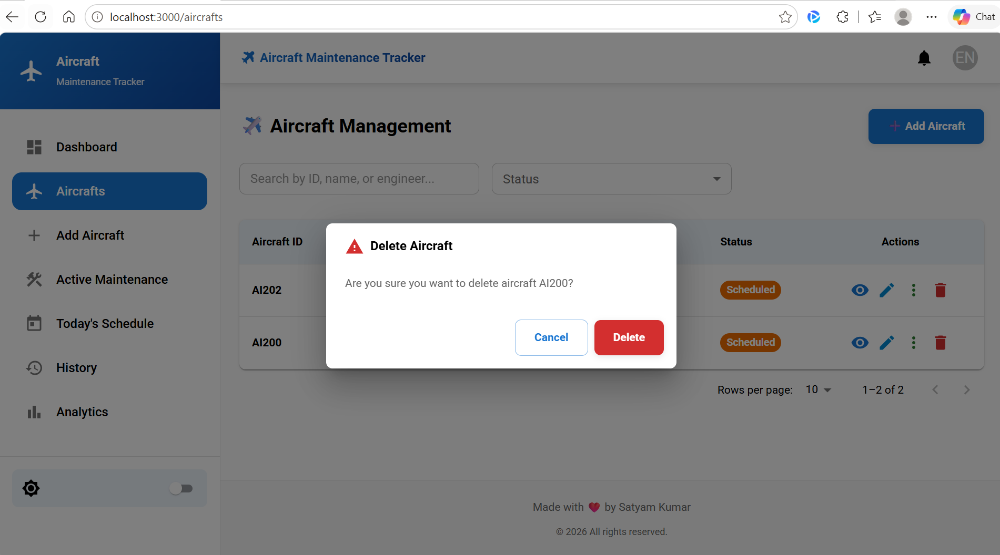
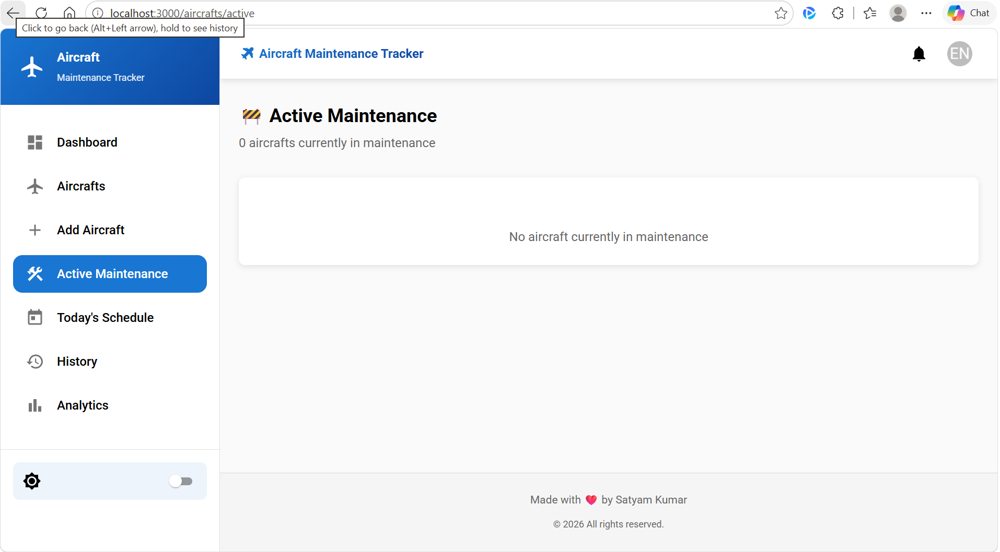
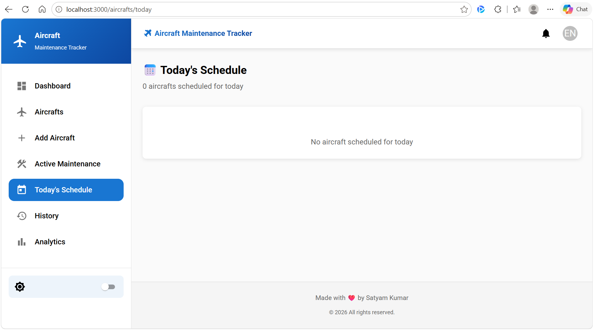
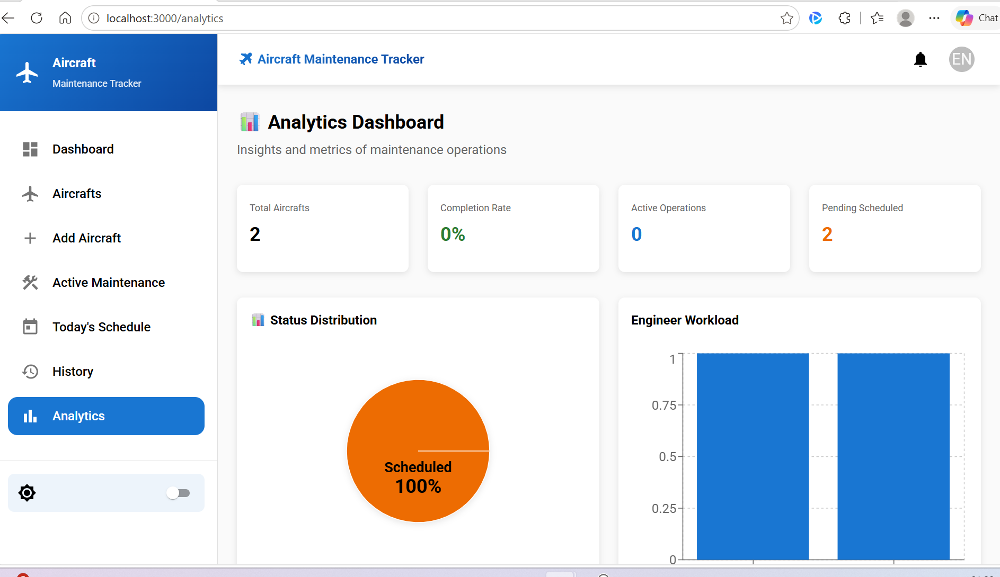
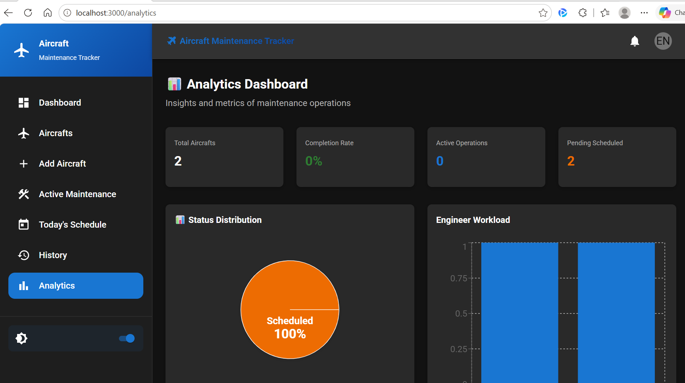

# ✈️ Aircraft Maintenance Tracker System

[](https://react.dev)
[](https://www.javascript.com)
[](https://mui.com)
[](https://vitejs.dev)
[](https://nodejs.org)
[](https://expressjs.com)
[](LICENSE)
[](https://github.com/SatyamKumar7911/Aircraft-Maintenance-Tracker)

---

## 🎯 Real-Time Aircraft Maintenance Monitoring & Management Dashboard

A **production-ready**, enterprise-grade aircraft maintenance tracking platform that enables aviation teams to seamlessly register aircraft, monitor maintenance progress in real-time, track status transitions with precision, manage maintenance schedules, and visualize critical KPIs through an interactive, responsive dashboard.

> **Built for the modern aviation industry** — combining intuitive user experience with powerful analytics to streamline aircraft maintenance operations.

---

## 📑 Table of Contents

- [✨ Features](#-features)
- [📸 Screenshots](#-screenshots)
- [🛠️ Tech Stack](#%EF%B8%8F-tech-stack)
- [📁 Folder Structure](#-folder-structure)
- [🏗️ System Overview](#%EF%B8%8F-system-overview)
- [📊 Data Flow](#-data-flow)
- [🚀 Quick Start](#-quick-start)
- [📖 Usage Guide](#-usage-guide)
- [🔄 Workflow Diagram](#-workflow-diagram)
- [📊 Dashboard Overview](#-dashboard-overview)
- [📱 Application Pages](#-application-pages)
- [🎯 Future Enhancements](#-future-enhancements)
- [💬 Contact & Support](#-contact--support)

---

## ✨ Features

### 🛩️ Aircraft Registration & Management
- **Add New Aircraft** — Register aircraft with comprehensive details
- **Engineer Assignment** — Assign engineers to maintenance tasks
- **Maintenance Scheduling** — Plan and schedule maintenance operations
- **Aircraft Database** — Maintain a complete inventory

### 🔄 Status Management System
- **Status Tracking** — Monitor aircraft through: `SCHEDULED` → `IN_PROGRESS` → `COMPLETED`
- **Transition Validation** — Enforce valid state transitions
- **Status History** — Complete audit trail of all changes
- **Engineer Attribution** — Track responsible engineer for each transition

### 🚧 Active Maintenance Tracking
- **Real-Time Overview** — Monitor aircraft currently under maintenance
- **Progress Indicators** — Visual status representation
- **Engineer Details** — See who's working on what
- **Maintenance Timeline** — Track maintenance duration

### 📅 Daily Maintenance Schedule
- **Today's Schedule** — View aircraft scheduled for today's maintenance
- **Quick Overview** — Priority list of maintenance tasks
- **Schedule Planning** — Optimize engineer assignments
- **Schedule Notifications** — Stay updated on upcoming tasks

### 📜 Maintenance History & Timeline
- **Complete History** — Track all status transitions with timestamps
- **Chronological View** — Newest changes first
- **Status Transition Details** — Engineer info and timing
- **Historical Analysis** — Identify maintenance patterns

### 📊 Advanced Analytics Dashboard
- **Status Distribution** — Pie charts showing aircraft status breakdown
- **Engineer Workload** — Bar charts analyzing workload distribution
- **Maintenance Trends** — Timeline visualization of maintenance patterns
- **KPI Metrics** — Overall completion rates and performance indicators
- **Custom Reports** — Generate insights for decision making

### 🔍 Smart Search & Filtering
- **Aircraft ID Search** — Quick lookup by aircraft identifier
- **Engineer Name Filtering** — Find aircraft by assigned engineer
- **Status Filters** — Group by maintenance status
- **Date Range Filtering** — Analyze historical data by timeframe

### 🌙 Dark Mode Support
- **Theme Toggle** — Easy switching between light and dark modes
- **Persistent Preferences** — User theme preference saved automatically
- **Professional Design** — Optimized for extended use and reduced eye strain
- **WCAG Compliant** — Accessibility standards met

### ⚡ Performance & UX
- **Responsive Design** — Works seamlessly on desktop, tablet, and mobile
- **Instant Feedback** — Toast notifications for all actions
- **Confirmation Dialogs** — Prevent accidental operations
- **Form Validation** — Real-time input validation with error messages

---

## 📸 Screenshots

### 📊 Dashboard Overview

*KPI cards showing total aircraft, active maintenance, scheduled, and completed counts. Status distribution charts and analytics at a glance.*

### ✈️ Aircraft Management

*Comprehensive aircraft table with search functionality, status filters, and quick actions for viewing, editing, and deleting aircraft.*

### ➕ Add Aircraft Registration

*User-friendly form for registering new aircraft with validation, engineer assignment, and maintenance date scheduling.*

### ❌ Delete Aircraft

*Quick and safe aircraft removal with confirmation dialog to prevent accidental deletions from the system.*

### 🚧 Active Maintenance Tracking

*Real-time cards showing all aircraft currently under maintenance with engineer details and progress indicators.*

### 📅 Today's Maintenance Schedule

*Quick view of all maintenance operations scheduled for today with engineer assignments and status overview.*

### 📈 Analytics & Reports

*Advanced visualizations including status distribution pie charts, engineer workload bar charts, and maintenance timeline trends.*


### 🌙 Dark Mode Interface

*Professional dark theme support for comfortable extended use with full functionality preservation.*

---

## 🛠️ Tech Stack

### 🎨 Frontend Architecture
- **React.js** `18.2+` — Modern UI framework with hooks and functional components
- **Vite** `5.0+` — Lightning-fast build tool and development server
- **Material-UI (MUI)** `5.0+` — Professional component library with theme support
- **React Router** `6.0+` — Client-side routing and navigation
- **Axios** — Promise-based HTTP client for API communication
- **Recharts** — Composable charting library for data visualization
- **React Hook Form** — Performant, flexible form validation
- **Framer Motion** — Animation library for smooth transitions

### 🎯 State Management
- **Context API** — Lightweight state management with React hooks
- **Custom Hooks** — Reusable logic encapsulation
- **Local Storage** — Persist user preferences and theme settings

### 🔌 Backend Services
- **Node.js** `16+` — JavaScript runtime
- **Express.js** `4.18+` — Minimal and flexible web framework
- **Mock Data Store** — In-memory data persistence (ready for database integration)
- **RESTful API** — Standard HTTP endpoints for client communication

### 📦 Development Tools
- **Vitest** — Unit testing framework with Vite integration
- **npm** — Package manager and task runner
- **ES6+ & Modern JavaScript** — Latest language features and best practices

---

## 📁 Folder Structure

```
Aircraft Maintenance Tracker/
│
├── 📄 README.md                          # Project documentation (this file)
├── 📁 backend/                           # Express.js API Server
│   ├── package.json                      # Backend dependencies
│   ├── README.md                         # Backend documentation
│   └── src/
│       ├── server.js                     # Main server entry point
│       ├── middleware/
│       │   └── errorHandler.js           # Error handling middleware
│       ├── models/
│       │   └── Aircraft.js               # Aircraft data model
│       └── routes/
│           └── aircraft.js               # Aircraft API routes
│
├── 📁 frontend/                          # React.js SPA
│   ├── package.json                      # Frontend dependencies
│   ├── README.md                         # Frontend documentation
│   ├── vite.config.js                    # Vite configuration
│   ├── vitest.config.js                  # Vitest configuration
│   ├── vitest.setup.js                   # Test setup
│   ├── index.html                        # HTML entry point
│   └── src/
│       ├── main.jsx                      # React entry point
│       ├── index.css                     # Global styles
│       ├── App.jsx                       # Root component
│       │
│       ├── components/
│       │   ├── pages/
│       │   │   ├── NotFound.jsx          # 404 page
│       │   │   ├── aircraft/
│       │   │   │   ├── AircraftListPage.jsx         # Aircraft management
│       │   │   │   ├── AddAircraftPage.jsx          # Aircraft registration
│       │   │   │   ├── AircraftDetailPage.jsx       # Aircraft details
│       │   │   │   ├── ActiveMaintenancePage.jsx    # Active maintenance
│       │   │   │   └── TodaySchedulePage.jsx        # Today's schedule
│       │   │   ├── analytics/
│       │   │   │   └── AnalyticsPage.jsx            # Analytics dashboard
│       │   │   ├── dashboard/
│       │   │   │   └── DashboardPage.jsx            # Main dashboard
│       │   │   └── history/
│       │   │       └── HistoryPage.jsx              # Maintenance history
│       │   │
│       │   └── shared/
│       │       ├── layouts/
│       │       │   ├── Header.jsx                   # Navigation header
│       │       │   └── Sidebar.jsx                  # Sidebar navigation
│       │       ├── forms/
│       │       │   ├── AddAircraftForm.jsx          # Aircraft registration form
│       │       │   └── UpdateStatusDialog.jsx       # Status update modal
│       │       ├── ConfirmDialog.jsx                # Confirmation modal
│       │       └── StatCard.jsx                     # Statistics card
│       │
│       ├── context/
│       │   ├── AircraftContext.jsx                  # Aircraft state management
│       │   └── ThemeContext.jsx                     # Theme state management
│       │
│       ├── hooks/
│       │   ├── useAircraft.js                       # Aircraft operations hook
│       │   └── useDarkMode.js                       # Dark mode hook
│       │
│       ├── services/
│       │   └── aircraftService.js                   # API communication layer
│       │
│       └── utils/
│           └── helpers.js                           # Utility functions
│
└── 📁 docs/
    └── screenshots/                      # Application screenshots
        ├── dashboard.png
        ├── aircraft-list.png
        ├── add-aircraft.png
        ├── delete-aircraft.png
        ├── active-maintenance.png
        ├── schedule.png
        ├── analytics.png
        └── dark-mode.png
```

---

## 🏗️ System Overview

```
┌─────────────────────────────────────────────────────────────┐
│                    Client Browser                            │
│  (http://localhost:3000)                                    │
└──────────────────────┬──────────────────────────────────────┘
                       │
                       │ HTTP/REST
                       ↓
┌─────────────────────────────────────────────────────────────┐
│                    React Frontend                            │
│  ┌──────────────────────────────────────────────────────┐  │
│  │  Pages: Dashboard, Aircraft, Analytics, History      │  │
│  └──────────────────┬───────────────────────────────────┘  │
│                     │                                        │
│  ┌──────────────────▼───────────────────────────────────┐  │
│  │  Context API (AircraftContext)                       │  │
│  │  - aircrafts state                                   │  │
│  │  - activityLog state                                 │  │
│  │  - CRUD operations                                   │  │
│  └──────────────────┬───────────────────────────────────┘  │
│                     │                                        │
│  ┌──────────────────▼───────────────────────────────────┐  │
│  │  Services Layer (aircraftService)                    │  │
│  │  - API client (axios)                                │  │
│  │  - Request/Response handling                         │  │
│  └──────────────────┬───────────────────────────────────┘  │
│                     │                                        │
│  ┌──────────────────▼───────────────────────────────────┐  │
│  │  LocalStorage                                        │  │
│  │  - Persistent state (aircrafts, log, theme)         │  │
│  └──────────────────────────────────────────────────────┘  │
└──────────────────────┬──────────────────────────────────────┘
                       │
                       │ HTTP REST API
                       │ (http://localhost:5000)
                       ↓
┌─────────────────────────────────────────────────────────────┐
│                  Express.js Backend                          │
│  ┌──────────────────────────────────────────────────────┐  │
│  │  Routes: /api/aircrafts                              │  │
│  │  - GET /     (list all)                              │  │
│  │  - POST /    (create)                                │  │
│  │  - PUT /:id  (update)                                │  │
│  │  - DELETE /  (delete)                                │  │
│  │  - GET /active/list                                  │  │
│  │  - GET /schedule/today                               │  │
│  │  - GET /:id/history                                  │  │
│  │  - GET /stats/overview                               │  │
│  └──────────────────┬───────────────────────────────────┘  │
│                     │                                        │
│  ┌──────────────────▼───────────────────────────────────┐  │
│  │  Controllers/Handlers                                │  │
│  │  - Request validation                                │  │
│  │  - Business logic                                    │  │
│  │  - Response formatting                               │  │
│  └──────────────────┬───────────────────────────────────┘  │
│                     │                                        │
│  ┌──────────────────▼───────────────────────────────────┐  │
│  │  Models (Aircraft.js)                                │  │
│  │  - Class definitions                                 │  │
│  │  - Validation logic                                  │  │
│  │  - Status transitions                                │  │
│  └──────────────────┬───────────────────────────────────┘  │
│                     │                                        │
│  ┌──────────────────▼───────────────────────────────────┐  │
│  │  Data Store (AircraftStore)                          │  │
│  │  - In-memory Map<aircraftId, Aircraft>               │  │
│  │  - CRUD operations                                   │  │
│  │  - Status change tracking                            │  │
│  └──────────────────────────────────────────────────────┘  │
└─────────────────────────────────────────────────────────────┘
```

---

## 📊 Data Flow

### 1️⃣ Add Aircraft Flow

```
User Input (Form)
       ↓
useForm (React Hook Form)
       ↓
Validation
       ↓
addAircraft() [Context]
       ↓
create new Aircraft object
       ↓
Add to aircrafts state
       ↓
Save to LocalStorage
       ↓
Toast notification
       ↓
Redirect to /aircrafts
```

### 2️⃣ Update Status Flow

```
User clicks "Update Status"
       ↓
UpdateStatusDialog opens
       ↓
User selects new status
       ↓
Validation: Check transition rules
       ↓
updateStatus() [Context]
       ↓
Find aircraft in state
       ↓
Add history entry
       ↓
Update status
       ↓
Update updatedAt timestamp
       ↓
Save to LocalStorage
       ↓
addActivity() - Log event
       ↓
Toast notification
```

### 3️⃣ Fetch Aircrafts Flow

```
Component mounts / State changes
       ↓
getStatistics() [Context]
       ↓
Calculate stats from aircrafts array
       ↓
Return { total, scheduled, inProgress, completed }
       ↓
Update component state
       ↓
Re-render with new data
```

---

## 🚀 Quick Start

### ✅ Prerequisites
- **Node.js** 16 or higher
- **npm** (included with Node.js)
- **Git** (optional, for cloning)

### 📥 Installation Steps

#### Step 1: Clone the Repository
```bash
git clone https://github.com/SatyamKumar7911/Aircraft-Maintenance-Tracker.git
cd "Aircraft Maintenance Tracker"
```

#### Step 2: Install & Start Backend
```bash
cd backend
npm install
npm run dev
```

Expected output:
```
✈️  Aircraft Maintenance Tracker API running on http://localhost:5000
📍 Health check: http://localhost:5000/health
```

#### Step 3: Install & Start Frontend (New Terminal)
```bash
cd frontend
npm install
npm run dev
```

Expected output:
```
VITE v5.0.0  ready in 500 ms
➜  Local:   http://localhost:3000/
```

#### Step 4: Open in Browser
Navigate to **[http://localhost:3000](http://localhost:3000)**

---

## 📖 Usage Guide

### 🎓 Testing the System

#### 1️⃣ Register a New Aircraft
1. Navigate to **`/aircrafts/add`**
2. Fill in the registration form:
   - **Aircraft ID:** `AI101`
   - **Name:** `Boeing 737-800`
   - **Engineer:** `John Smith`
   - **Maintenance Date:** `2024-12-20`
3. Click **"Register Aircraft"**
4. See success notification and redirect to aircraft list

#### 2️⃣ View Dashboard Statistics
1. Navigate to **`/`** (Dashboard)
2. View updated KPI cards:
   - Total Aircraft count
   - Active Maintenance count
   - Scheduled Aircraft count
   - Completed Aircraft count
3. Analyze status distribution charts

#### 3️⃣ Update Aircraft Status
1. Go to **`/aircrafts`**
2. Find your registered aircraft
3. Click **"Edit"** or **"Update Status"**
4. Change status from `SCHEDULED` to `IN_PROGRESS`
5. Confirm the update
6. See aircraft moved to active maintenance

#### 4️⃣ Complete Maintenance
1. Go to **`/aircrafts`** or **`/aircrafts/active`**
2. Click **"Edit"** on the aircraft
3. Change status to `COMPLETED`
4. Aircraft moves out of active list
5. Check **`/history`** for timeline entry

#### 5️⃣ View Analytics
1. Navigate to **`/analytics`**
2. Analyze visualizations:
   - Status distribution pie chart
   - Engineer workload bar chart
   - Maintenance timeline
   - Completion rate metrics

#### 6️⃣ Check Today's Schedule
1. Go to **`/aircrafts/today`**
2. View all scheduled maintenance for today
3. See engineer assignments and dates

#### 7️⃣ Review Maintenance History
1. Navigate to **`/history`**
2. Browse complete timeline (newest first)
3. See status transitions with timestamps
4. Track engineer attributions

---

## 🔄 Workflow Diagram


**Workflow Rules:**
- ✅ `SCHEDULED` → `IN_PROGRESS` — Valid transition
- ✅ `IN_PROGRESS` → `COMPLETED` — Valid transition
- ❌ Direct `SCHEDULED` → `COMPLETED` — Invalid, must go through IN_PROGRESS
- ❌ `COMPLETED` → any state — Terminal state, no reverse transitions

---

## 📊 Dashboard Overview

The dashboard provides comprehensive aircraft maintenance metrics and insights:

### 📈 Key Performance Indicators (KPIs)
- **Total Aircraft** — Complete inventory count
- **Active Maintenance** — Aircraft currently under maintenance
- **Scheduled Aircraft** — Upcoming maintenance operations
- **Completed Aircraft** — Successfully completed maintenance

### 📉 Analytics Charts
- **Status Distribution Pie Chart** — Visual breakdown of aircraft status
- **Engineer Workload Bar Chart** — Maintenance load per engineer
- **Maintenance Timeline** — Historical trend analysis
- **Completion Rate** — Performance metrics

### 📊 Real-Time Data
- **Recent Activity Feed** — Latest status changes
- **Live Statistics** — Updated as changes occur
- **Trend Analysis** — Identify patterns and bottlenecks
- **Performance Insights** — Optimize maintenance planning

---

## 📱 Application Pages

| Page | Route | Description |
|------|-------|-------------|
| **Dashboard** | `/` | Main KPI dashboard with charts and statistics overview |
| **Aircraft List** | `/aircrafts` | Complete aircraft inventory with search, filter, and management actions |
| **Add Aircraft** | `/aircrafts/add` | Registration form for new aircraft with validation |
| **Aircraft Details** | `/aircrafts/:id` | Detailed view of specific aircraft with maintenance history |
| **Active Maintenance** | `/aircrafts/active` | Real-time tracking of aircraft currently under maintenance |
| **Today's Schedule** | `/aircrafts/today` | Daily maintenance operations and engineer assignments |
| **History Timeline** | `/history` | Chronological maintenance status change history |
| **Analytics** | `/analytics` | Advanced visualizations and performance reports |
| **Not Found** | `/404` | Error page for invalid routes |

---

## 🎯 Future Enhancements

### 🗄️ Database Integration
- [ ] **Spring Boot Backend** — Migrate to enterprise-grade Java backend
- [ ] **PostgreSQL/MySQL** — Replace in-memory storage with persistent database
- [ ] **Database Migrations** — Implement version control for schema changes
- [ ] **Connection Pooling** — Optimize database connections

### 🔐 Security & Authentication
- [ ] **User Authentication** — Login/registration system
- [ ] **Role-Based Access Control (RBAC)** — Different permission levels
- [ ] **JWT Tokens** — Secure API authentication
- [ ] **Password Encryption** — BCrypt hashing for security
- [ ] **Audit Logging** — Track all user actions

### ⚡ Real-Time Features
- [ ] **WebSocket Integration** — Live status updates for multiple users
- [ ] **Push Notifications** — Alert engineers about maintenance tasks
- [ ] **Real-Time Collaboration** — Multi-user simultaneous editing
- [ ] **Live Activity Feed** — See changes as they happen

### 🤖 AI & Predictive Analytics
- [ ] **Aircraft Health Prediction** — ML-based maintenance forecasting
- [ ] **Anomaly Detection** — Identify unusual maintenance patterns
- [ ] **Predictive Maintenance** — Prevent failures before they occur
- [ ] **Resource Optimization** — AI-driven engineer scheduling

### 📱 Mobile & Cross-Platform
- [ ] **React Native App** — Native iOS and Android applications
- [ ] **Progressive Web App (PWA)** — Offline-capable web app
- [ ] **Mobile-First Design** — Optimize for mobile devices
- [ ] **Push Notifications** — Native mobile notifications

### ☁️ Cloud & DevOps
- [ ] **Docker Containerization** — Package app in containers
- [ ] **Kubernetes Orchestration** — Scale across multiple nodes
- [ ] **AWS Deployment** — Deploy to Amazon Web Services
- [ ] **Azure Integration** — Microsoft Azure cloud support
- [ ] **CI/CD Pipeline** — Automated testing and deployment
- [ ] **Cloud Database** — Managed database services

### 📊 Advanced Analytics
- [ ] **Business Intelligence** — BI tool integration
- [ ] **Custom Reports** — User-defined analytics queries
- [ ] **Data Export** — Export to CSV, Excel, PDF
- [ ] **Performance Benchmarking** — Compare against industry standards

### 🔗 Integrations
- [ ] **Third-Party APIs** — Integration with external services
- [ ] **Email Notifications** — Send maintenance updates via email
- [ ] **Calendar Integration** — Sync with Google Calendar, Outlook
- [ ] **Slack Integration** — Post updates to Slack channels

---

## 💬 Contact & Support

### 📧 Get in Touch
- **Email:** [satyam.kumar1183@gmail.com](mailto:satyam.kumar1183@gmail.com)
- **GitHub Issues:** [Report bugs & request features](https://github.com/SatyamKumar7911/Aircraft-Maintenance-Tracker/issues)
- **Discussions:** [Ask questions & discuss ideas](https://github.com/SatyamKumar7911/Aircraft-Maintenance-Tracker/discussions)

### 📚 Documentation & Resources
- **📖 Full Documentation:** [Project Wiki](https://github.com/SatyamKumar7911/


### 🔗 Important Links
- **⭐ GitHub Repository:** [Aircraft-Maintenance-Tracker](https://github.com/SatyamKumar7911/Aircraft-Maintenance-Tracker)
- **👤 Developer GitHub:** [@SatyamKumar7911](https://github.com/SatyamKumar7911)
- **🐛 Bug Reports:** [GitHub Issues](https://github.com/SatyamKumar7911/Aircraft-Maintenance-Tracker/issues)
- **💡 Feature Requests:** [GitHub Discussions](https://github.com/SatyamKumar7911/Aircraft-Maintenance-Tracker/discussions)

### 🆘 Troubleshooting

**Port Already in Use?**
```bash
# Change backend port
PORT=5001 npm run dev

# Change frontend port (edit vite.config.js)
# Change port: 3000 to port: 3001
```

**Module Not Found?**
```bash
rm -rf node_modules package-lock.json
npm install
```

**CORS Errors?**
- Ensure backend runs on `http://localhost:5000`
- Check frontend `.env.local` has correct API URL
- Backend has CORS enabled by default

**API Connection Issues?**
```bash
# Test backend health
curl http://localhost:5000/health

# Verify backend is running
# Check browser console for errors
# Verify VITE_API_URL in .env.local
```

---

## 📜 License

This project is licensed under the **MIT License** — see the [LICENSE](LICENSE) file for details.

---

## 🙏 Acknowledgments

- **Material-UI Team** — For the excellent component library
- **React Community** — For the incredible ecosystem
- **Vite Team** — For the lightning-fast build tool
- **All Contributors** — For supporting this project

---

## ⭐ Show Your Support

If you find this project helpful or interesting, please consider:

1. **⭐ Star the Repository** — Shows appreciation and increases visibility
2. **🍴 Fork the Project** — Customize for your needs
3. **💬 Share Feedback** — Help us improve
4. **🐛 Report Issues** — Identify bugs and problems
5. **💡 Suggest Features** — Propose new capabilities
6. **👥 Share with Friends** — Spread the word

---

<div align="center">

### Built with ❤️ by [Satyam Kumar](https://github.com/SatyamKumar7911)

**[⬆ back to top](#-aircraft-maintenance-tracker-system)**

</div>
